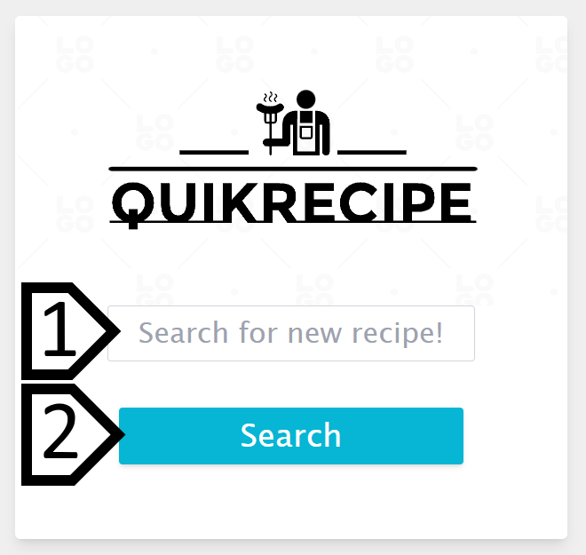
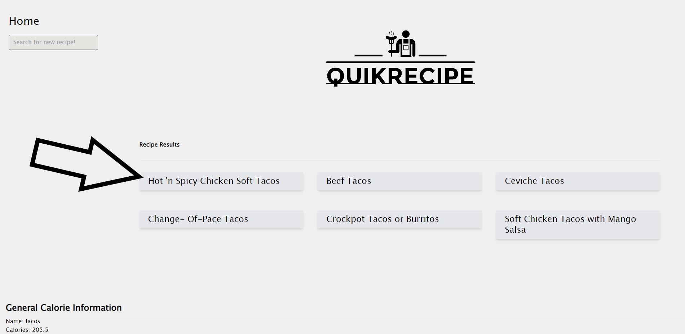
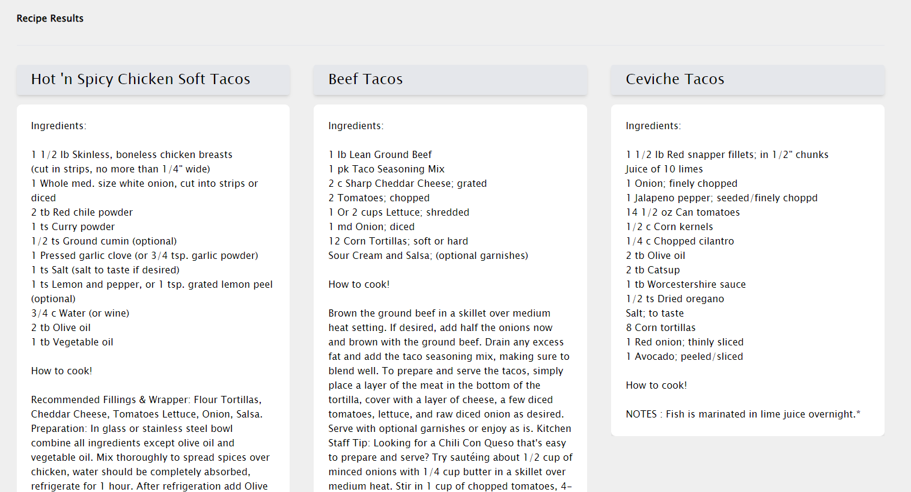
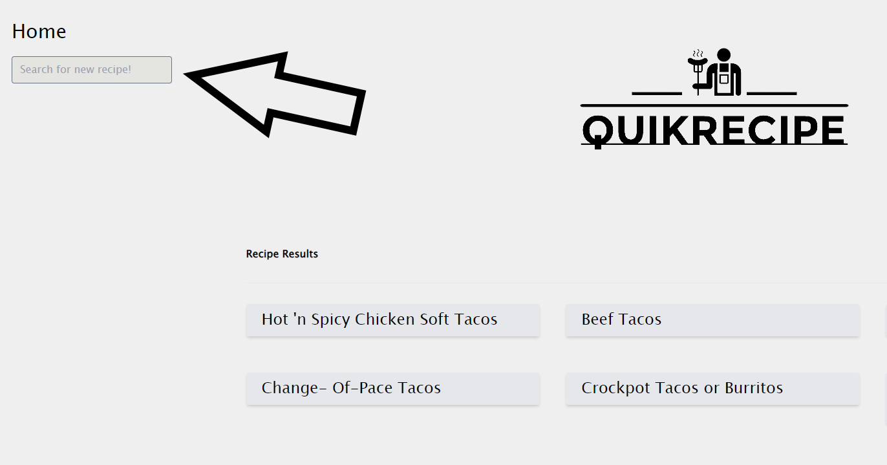

# QuikRecipe

[Link to deployed page](https://zechb7.github.io/QuikRecipe/)

Version: 1.0

Deployment Date: 1/17/2023

### Contributors:
* **MJ Jeong** - [GitHub](https://github.com/mjtic)
* **Zechariah Barret** - [GitHub](https://github.com/ZechB7)
* **Connor Bodin** - [GitHub](https://github.com/connorbodin)
* **Wiley Vincent** - [GitHub](https://github.com/WileyVincent)

## Purpose

QuikRecipe is a simple tool for looking up recipes and accompanying nutritional information. Users can use the initial search bar to look up a list of options. From there, a recipe may be chosen for more information.

## Getting Started

1. Navigate to [Quik Recipe](https://zechb7.github.io/Pantry-Inventory-and-calorie-Info/) in a browser.

2. Enter desired recipe in the search bar then press enter or click "search".

  

3. You will be taken to a list of results for available recipes. From here you can expand the recipe information by clicking on any of the options.

  

4. After clicking, further information will be shown on the page including ingredients cooking instructions

  

5. From the results page, you also have an option to make a new search, using the search bar in the top left. Use the enter key to search.

  

## Built Using:

**[Tailwind](https://tailwindcss.com/)** - CSS framework of choice.

**[JQuery](https://jquery.com/)** - JS library of choice.

**[CalorieNinjas](https://calorieninjas.p.rapidapi.com/v1/nutrition)** - API for displaying basic calorie information.

**[Recipe by API-Ninjas](https://api-ninjas.com/api/recipe)** - API for looking up recipes.

**[Daisy UI](https://daisyui.com/)** - for easier styling using tailwind.

## Development

Here is the charter we used to keep track of our progress and plan for the future: [charter.](https://docs.google.com/document/d/1hdtiVcMP_kd0J5KbVvTyVbF2O0C-vctW84k9r7vZiKs/edit?usp=sharing)

**Below are examples of our early wireframes.**

The initial search page:

  

Search result page:

  

Recipe information page:

  

https://user-images.githubusercontent.com/63430373/213012940-e39a37bc-7a75-4db7-aac7-fc20e431de7c.mp4

