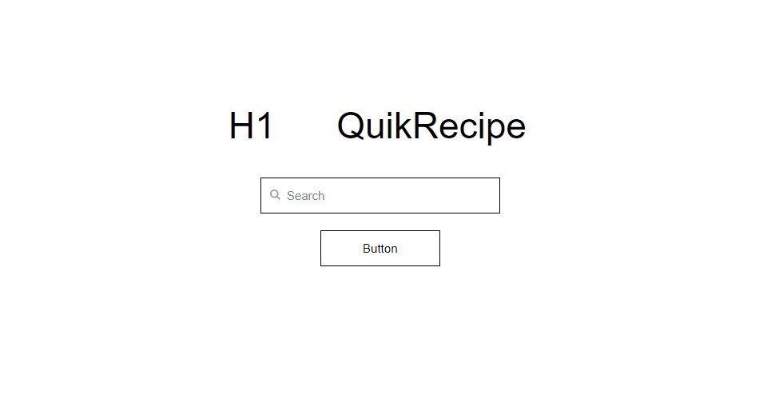
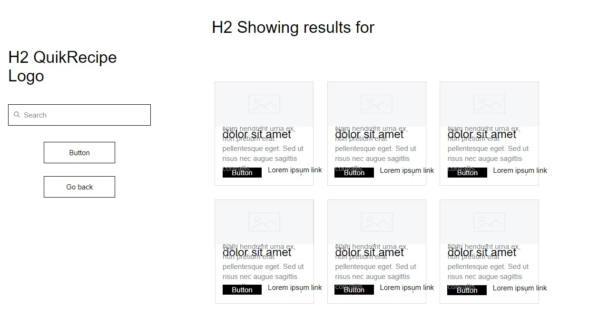
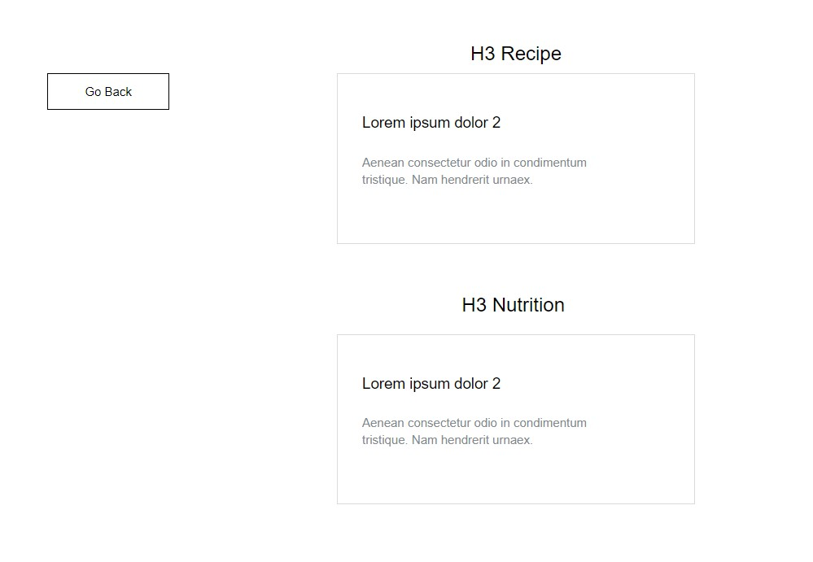

# QuikRecipe

(link to page)

Version 0.1

Deployment Date:

### Contributors:
* **MJ Jeong** -
* **Zechariah Barret** -
* **Connor Bodin** -
* **Wiley Vincent** -

## Purpose

QuikRecipe is a simple tool for looking up recipes and accompanying nutritional information. Users can use the initial search bar to look up a list of options. From there, a recipe may be chosen for more information.

## Getting Started

1. Navigate to (link).
2. Enter desired recipe in search bar and press enter or click "search".
3. You will be take to a list of options for available recipes.
4. From here choose your prefered recipe by clicking on it.
5. Now you will be taken to a page that displays the recipe and calorie count.

## Built Using:

**[Tailwind](https://tailwindcss.com/)**

**[JQuery](https://jquery.com/)**

## Development

**Below are examples of our early wireframes.**

The initial search page:

  

Search result page:

  

Recipe information page:

  

